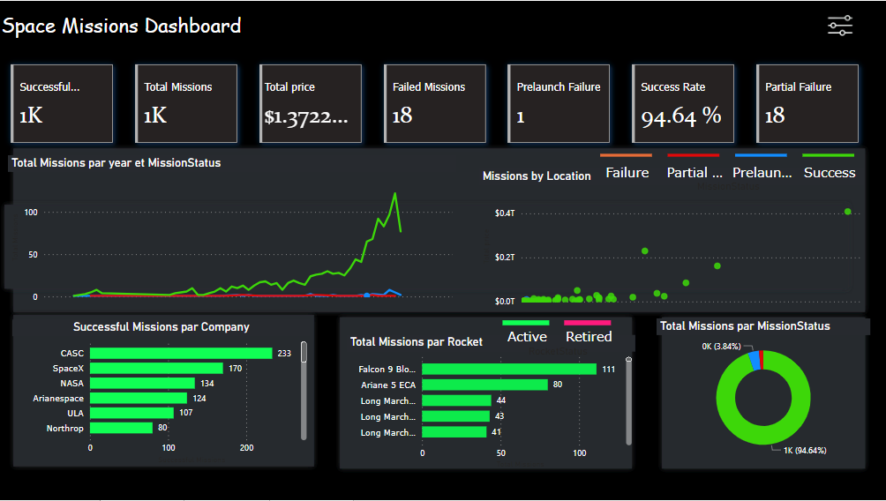

# Space Missions Dashboard
Welcome to the repository for our Space Missions Dashboard project, an interactive application designed to provide dynamic insights and in-depth analyses of space missions over the decades.

## Project Overview
Our Space Missions Dashboard is crafted with Power BI, aiming to democratize access to historical and current space missions data. It allows users to explore key success metrics, track the evolution of space technologies, and identify major industry trends.

## Features
Launch Success Rates: Visualize the reliability of different space agencies over time.
Total Missions: Discover the number of missions initiated, succeeded, or failed.
Locations: Explore launch sites and their histories.
Dynamic Filtering: Interact with the dashboard to filter data based on various criteria.

## Data Sources
This dashboard is built using data sourced from Maven Analytics, ensuring rich and reliable information.

## How to Use
Opening the Dashboard: Launch the .pbix file using Microsoft Power BI Desktop or the Power BI service.
Interacting with Visualizations: Click on different elements of the dashboard to refine the displayed information.
Customization: Feel free to adapt the dashboard to your analytical needs or visual preferences.
## Requirements
To get the most out of the Space Missions Dashboard, ensure you have:

Microsoft Power BI Desktop installed on your computer.
An internet connection for real-time data updates (optional).
